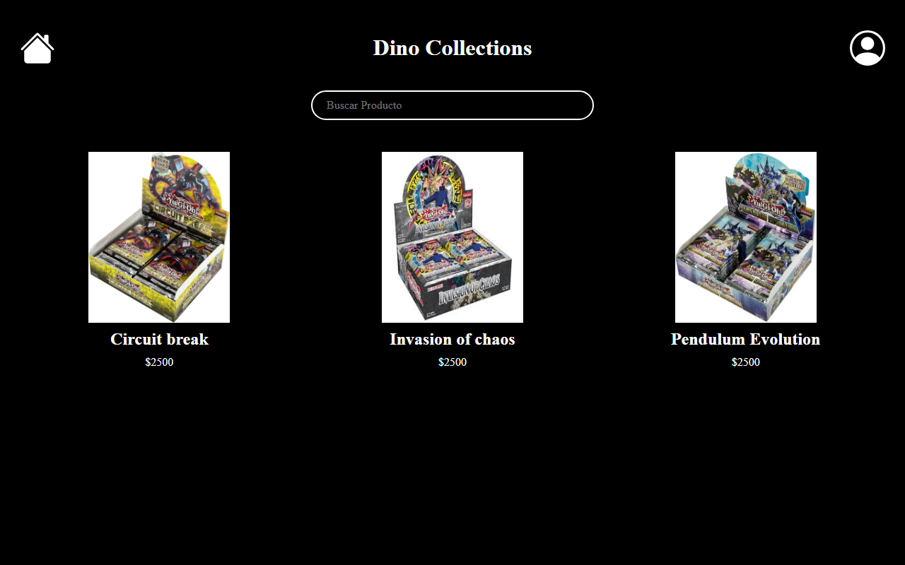
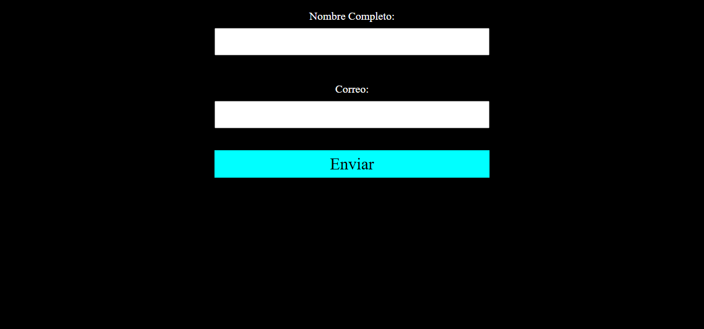

# Dino Collections - Accesibilidad web


Sitio de una tienda ficticia de sobres de cartas coleccionables, **Dino Collections**, desarrollado aplicando buenas prácticas de **accesibilidad web** para que pueda usarse con lectores de pantalla y navegación por teclado.

## Capturas de pantalla

| Catálogo | Formulario de contacto |
| --- | --- |
|  |  |

## Prácticas de accesibilidad aplicadas

| Práctica | Dónde se aplica |
| --- | --- |
| Idioma del documento con `lang="es"` | `index.html` |
| Cambio de idioma por elemento con `lang="en"` | Nombres de productos en inglés, para que el lector de pantalla los pronuncie correctamente |
| `aria-label` en enlaces que solo contienen íconos | Botones de inicio y contacto del encabezado |
| `aria-label` en campos sin etiqueta visible | Barra de búsqueda de productos |
| Texto alternativo descriptivo (`alt`) | Todas las imágenes de productos |
| `<label for="...">` asociado a cada campo | Formulario de contacto |
| Campos obligatorios con `required` | Nombre y correo del formulario |
| Estructura semántica | `header`, `main`, `section`, `article`, jerarquía de encabezados `h1` y `h2` |
| Alto contraste | Texto blanco sobre fondo negro |

## Tecnologías utilizadas

- HTML5 semántico
- SCSS (compilado a CSS) con Flexbox y CSS Grid
- Atributos WAI-ARIA

## Estructura del proyecto

```text
Accesibilidad/
├── index.html              # Catálogo de productos
├── contact.html            # Formulario de contacto
├── styles.scss / .css
├── contact_styles.scss / .css
└── Assets/                 # Imágenes de productos
```

## Instalación y uso

```bash
git clone https://github.com/Donaldo500/Accesibilidad.git
cd Accesibilidad
```

Abre `index.html` en el navegador. No requiere dependencias.

Para editar los estilos:

```bash
npx sass styles.scss styles.css
npx sass contact_styles.scss contact_styles.css
```

## Ejemplos de uso

- **Navegación por teclado**: usa `Tab` para recorrer el ícono de inicio, el campo de búsqueda y el ícono de contacto; cada elemento se anuncia con su `aria-label`.
- **Lector de pantalla**: con NVDA (Windows) o VoiceOver (macOS) activado, los nombres de productos en inglés se leen con pronunciación inglesa gracias al atributo `lang="en"`.
- **Auditoría**: abre las DevTools de Chrome, pestaña **Lighthouse**, y ejecuta un análisis de la categoría *Accessibility*.

Ejemplo de enlace accesible con ícono:

```html
<a href="contact.html" aria-label="Ir a la zona de contacto">
    <svg ...></svg>
</a>
```

## Contribuciones

Proyecto individual con fines de aprendizaje. Las sugerencias para mejorar la accesibilidad son bienvenidas mediante issues o pull requests.

## Autor

**Donaldo Ibarra** - [@Donaldo500](https://github.com/Donaldo500)
